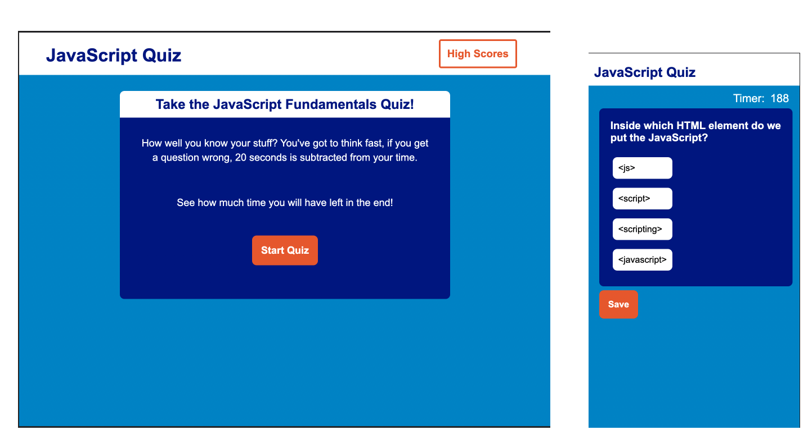

# module_4 Challenge: Code Quiz 

### In this assignment, I showcase my knowledge of Web API's and traversing the dom. 

This application was built with HTML, CSS and Javascript.

It is a timed javascript quiz. If you answer the questions wrong, time is subtracted from the countdown.

### Questions are copied from:
 https://www.w3schools.com/quiztest/quiztest.asp?qtest=JS

## Live app deployment can be found here:
https://nadybee.github.io/module_4/

